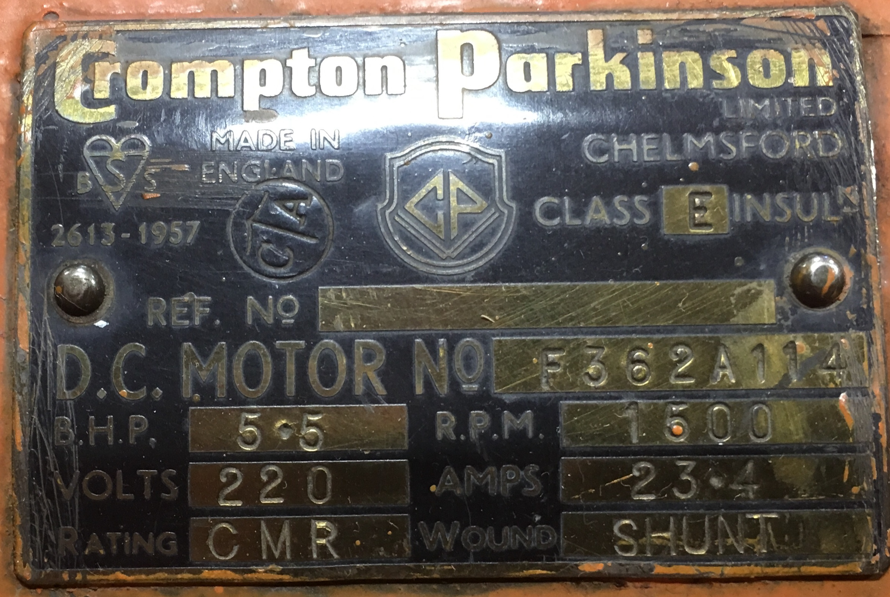

# EE 463 Hardware Project

## AC to DC Motor Drive

### Deadline: TBA (After the finals)

In this project you are required to make a controlled rectifier that will be used to drive a DC Motor.

 - Power Input: 3 Phase, or 1 Phase AC Grid
 - Output: Adjustable DC Output

You are free to choose any topology such as (but not limited to):

 - 3-Phase Thyristor Rectifier
 - 1-Phase Thyristor Rectifier
 - Diode Rectifier + Buck Converter

### Specs:

You are required to drive the following motor-generator sets:

We measured the motor's parameters as follows:

 - Armature Winding: 28 Ω, 13.3 mH
 - Series Winding: 65 mΩ, 260 uH
 - Shunt Winding: 8.26 kΩ, 6.4 H
 - [Interpoles](https://www.quora.com/Electrical-Machines-What-do-interpoles-do-in-DC-motors) Winding: 0.8 Ω, 5.8 mH
 - Inertia: TBA

I believe the most sensible way of connection is shunt-excited, however you are free to use any other connections (series, compound etc) if required.

### Project Steps:

- Choose your partners: Each group will consist of 3 people. You are free to choose your partners.

- Create a public repo: Open a public repo, which you will put all your work into. Please add [me](https://github.com/ozank) and [İlker](https://github.com/ilkersahin78) as a collaborator.

- Topology Selection: Discuss the advantages and disadvantages of each topology, and decide on a topology. You are required prepare a document to support your decision.

- Computer Simulations: According the your topology selection, you are going to run computer simulations, to prove the performance characteristics of your drive. It is best to simulate as detailed as possible to catch possible hardware problems (for example, how to generate control/gate signals).

- Component Selection: According to your analytical calculations and computer simulations decide on which components you are going to use. Not only choose the power components, but also decide on the control, and axillary components. Don't forget to plan logistics, it may take weeks to get some components.

- Implementation: Build a prototype as fast as possible, and keep iterating.

- Demo Day

### Hints:

Hardware implementation is quite risky. Design process and the prototyping can take a much longer time that you have anticipated. A simulation project can be straightforward, but a hardware project is like below:

Therefore, I stongly advise you to start working immediately, and:

TBA

